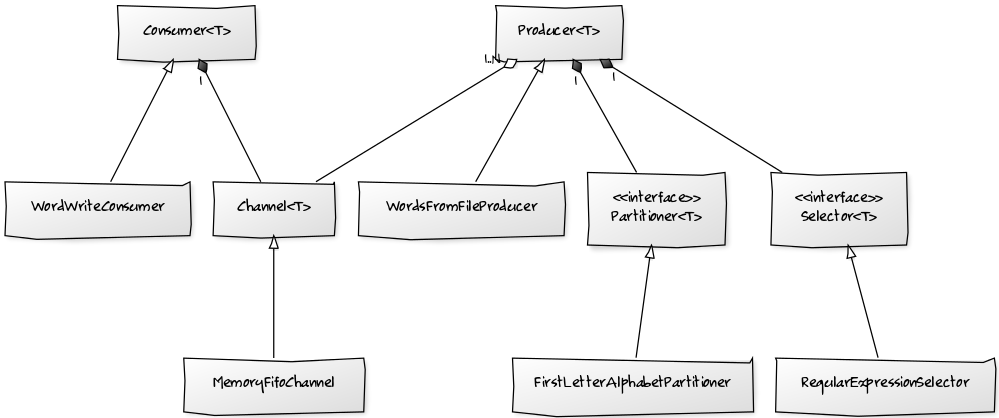

Exam_Word_Partition
===

## 목차
* [시스템 요구사항](#시스템-요구사항)  
* [개발 환경](#개발-환경)  
* [빌드 및 실행](#빌드-및-실행)  
    * [빌드](#빌드)  
    * [실행](#실행)  
* [로깅](#로깅)  
* [클래스 설계(작성중)](#클래스-설계)  
* [실행 결과(작성중)](#실행-결과)  

## 시스템 요구사항
* JDK 8 또는 그 이상

## 개발 환경
* Java 1.8, IntelliJ IDEA
* Maven3
* JUnit4, Mockito, PowerMock

## 빌드 및 실행
### 빌드
* Maven Download: https://maven.apache.org/download.cgi
```console
$ git clone https://github.com/crazysense/exam_word_partition.git
$ cd exam_word_partition
$ git checkout develop
$ git pull origin develop
$ mvn clean package [-Dmaven.test.skip=true]
```

### 실행
```console
$ cd target
$ java -jar ./word-partition-0.1.jar [SOURCE_PATH] [TARGET_DIR_PATH] [PATITION_NUMBER]
```

* 실행시 반드시 아래 세가지 인자가 순서대로 전달되어야 합니다.  

Args|Label|Description|Required
:---:|---|:---:|:---:
0|`SOURCE_PATH`|읽어올 파일의 경로. 접근 가능한 파일이 존재해야 함|O
1|`TARGET_DIR_PATH`|결과가 저장될 디렉토리의 경로. 생성 가능해야 함|O
2|`PARTITION_NUMBER`|1 < (N) < 27 범위에서 지정 가능|O

## 로깅
* Logger 는 java.util.logging.Logger 를 사용하였습니다.  
Logger 를 변경하려면 빌드가 완료된 target 디렉토리의 logging.properties 파일을 수정하고  
프로그램 실행시 JVM Argument 에 -Djava.util.logging.config.file 옵션을 추가하십시오.  
  
  *Logger 를 설정하지 않은 경우에는 ConsoleHandler 의 INFO Level 로 동작합니다.*
```console
$ java -Djava.util.logging.config.file=./logging.properties \
> -jar ./word-partition-0.1.jar [READ_FILE_PATH] [WRITE_DIR_PATH] [PATITION_NUMBER]
```

## 클래스 설계
### 주요 컴포넌트

* Producer&lt;T&gt;
  * Producer 는 스트림이 시작되는 곳으로, 스트림에 데이터를 제공하는 역할을 합니다.
  스레드로 동작하기 위해 Runnable 인터페이스를 구현한 추상클래스이며, Producer 클래스를 상속받아 실제 Producer 의 동작을 개발해야 합니다.  
  데이터를 필터하기 위한 Selector, 데이터를 파티션하기 위한 Partitioner, 그리고 데이터를 버퍼로 전송하기 위한 파티션 별 Channel 리스트를 갖습니다.  
  스레드가 시작되면 스트림이 종료될 때 까지 반복해서 데이터를 생성하며, 생성된 데이터를 특정 Channel 로 전송합니다.  
  만약 Producer 에서 EOS (End Of Stream) 플래그가 설정되면 가지고 있는 모든 Channel 리스트에 EOS 시그널을 전송하고 Producer 를 종료합니다.  
  시작과 종료 시점에 각각 open() 과 close() 가 호출되므로 필요한 경우 여기에서 리소스를 준비하고 제거할 수 있습니다.  
     
  * Producer 를 구현하기 위해서는 아래 메서드를 반드시 구현해야 합니다.  
  
    Implements|Description
    ---|---
    `boolean isEndOfStream()`|스트림의 종료 여부
    `T execute()`|데이터의 생성
    `void open()`|리소스의 준비
    `void close()`|리소스의 제거
    
* WordsFromFileProducer  
  * Producer 추상클래스를 상속받아 실제 동작을 구현한 클래스로, BufferedReader 를 사용하여 지정된 파일로부터 
  Line by line 으로 데이터를 읽고 문자열 데이터를 생성합니다.  
  파일의 끝까지 읽은 경우 EOS 값을 true 로 설정하여 Producer 가 정상 종료되도록 합니다.
  open() 에서 파일을 읽기 위한 Reader 를 생성하며, close() 에서 열려있는 Reader 를 정리합니다.
    
* Consumer&lt;T&gt;
  * Consumer 는 스트림이 끝나는 곳으로, 스트림으로부터 데이터를 소비하는 역할을 합니다.  
   스레드로 동작하기 위해 Runnable 인터페이스를 구현한 추상클래스이며, Consumer 클래스를 상속받아 실제 Consumer 의 동작을 개발해야 합니다.
   Channel 로부터 데이터를 가져오기 위해 하나의 Channel 을 가지고 있으며 스레드가 시작되면 스트림이 종료될 때 까지 반복해서 데이터를 소비합니다.  
   Channel 로부터 EOS 시그널을 수신하면 반복처리를 종료하고 Consumer 를 종료합니다.  
   Producer 와 마찬가지로 시작과 종료 시점에 각각 open(), close() 가 호출되므로 필요한 경우 여기에서 리소스를 준비하고 제거할 수 있습니다.  
     
  * 병렬 파티션 개수에 따라 클래스가 복사될 수 있으므로 Cloneable 인터페이스를 구현합니다. 만약 새로운 Consumer 를 개발할 때 
  내부에 복사될 수 없는 객체가 존재할 경우 복사된 클래스가 내부의 동일한 객체를 참조하지 않도록 clone() 을 구현해야 합니다.  
     
  * Consumer 를 구현하기 위해서는 아래 메서드를 반드시 구현해야 합니다.
    
    Implements|Description
    ---|---
    `void execute(T value)`|데이터의 소비
    `void open()`|리소스의 준비
    `void close()`|리소스의 제거
    
* WordWriteConsumer
  * Consumer 추상클래스를 상속받아 실제 동작을 구현한 클래스로, BufferedWriter 를 사용하여 특정 파일에 데이터를 기록합니다.  
  설정된 파티션이 실제 데이터 처리를 위한 최대 파티션보다 작게 설정된 경우 (e.g. a-z 까지의 데이터가 존재할 경우 최대 26개의 파티션이 
  필요하지만 그보다 작게 설정된 경우) 를 위하여 파일에 데이터를 기록하기 위한 BufferedWriter 를 HashMap 으로 가지고 있습니다.  
  open() 에서 HashMap 을 초기화하며, close() 에서 로드된 Writer 들을 정리합니다.
  
* Selector&lt;T&gt;
   * Selector 는 데이터를 필터링 하기 위한 인터페이스로, 데이터를 검사하고 조건에 만족하지 않는 경우 스트림에서 제거합니다.  
    데이터를 특정 조건으로 필터링할 경우 Selector 인터페이스를 구현하고 Producer 에 등록하십시오.     
    
     Implements|Description
     ---|---
     `boolean filter(T value)`|데이터 필터링 (true: 통과, false: 제거)  
    
* RegularExpressionSelector
  * Selector 를 구현한 클래스로, 정규식을 등록하고 데이터가 해당 정규식에 매칭되는 경우 데이터를 통과시킵니다.  
  여기에서는 첫 문자가 알파벳인 경우에는 통과시키므로 (^[a-zA-Z].*$) 값을 정규식으로 사용합니다.

* Partitioner&lt;T&gt;
   * Partitioner 는 데이터를 특정 조건에 맞게 파티션하기 위한 인터페이스로, 
  데이터와 Bucket (Max Partition Number) 이 주어지면 해당 데이터가 보내질 Partition ID 를 리턴합니다.  
  파티션은 0 부터 시작합니다. 일반적으로 0 보다 작거나 Bucket 을 초과하는 Partition ID 가 리턴될 경우, 데이터를 스트림에서 제거하므로
  Partitioner 를 구현할 때에는 이 값을 초과하지 않도록 주의해야 합니다.  
  
     Implements|Description
     ---|---
     `int partition(T value, int bucket)`|데이터를 파티션
  
* FirstLetterAlphabetPartitioner
  * Partitioner 를 구현한 클래스로 첫 문자(Character)에 따라 지정된 값으로 파티션 합니다.  
  'a..z' 까지의 문자를 각각 0..25 의 값으로 구분하여 bucket 과 mod 연산을 통해 파티션하며, 
  대소문자를 구분하지 않습니다. 즉, 'a' 와 'A' 는 동일하게 0 번 파티션으로 지정됩니다. 


(TODO : 계속)  
  
## 실행 결과
(TODO : 계속)  
이미지 붙일 것.