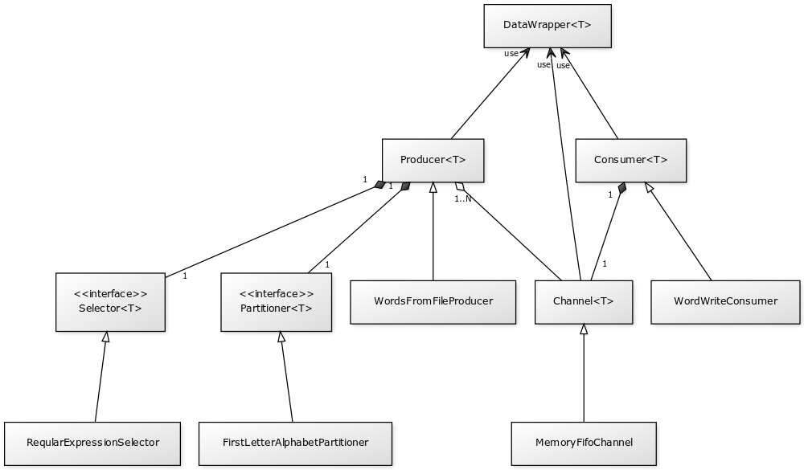
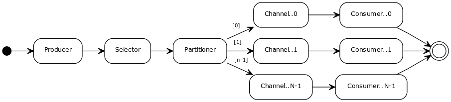
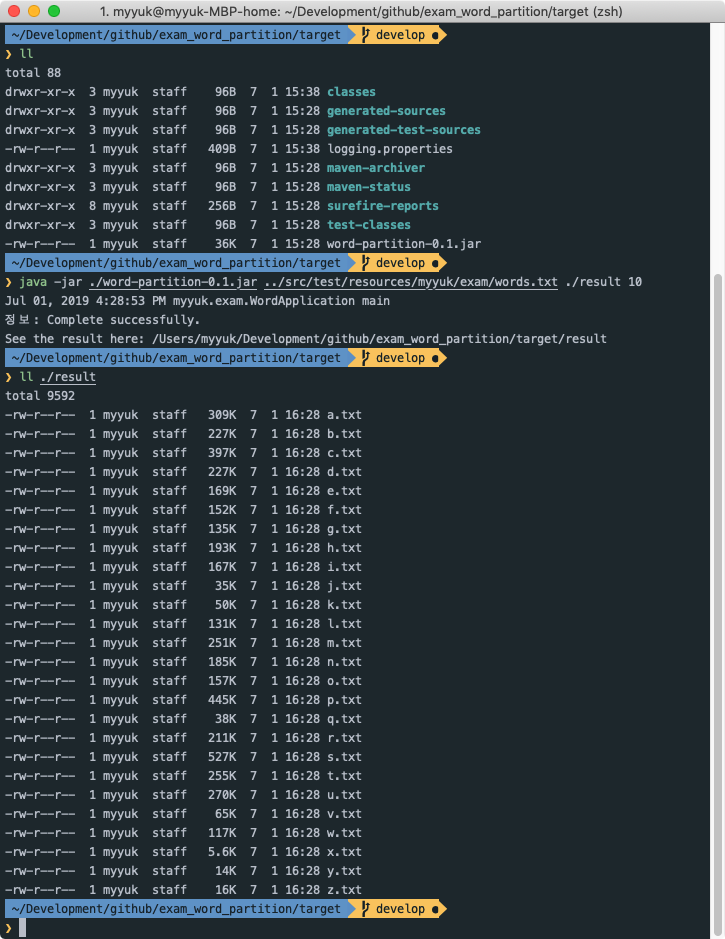

Exam_Word_Partition
===

## 목차
* [시스템 요구사항](#시스템-요구사항)  
* [개발 환경](#개발-환경)  
* [빌드 및 실행](#빌드-및-실행)  
    * [빌드](#빌드)  
    * [실행](#실행)  
* [로깅](#로깅)  
* [클래스 설계](#클래스-설계)  
* [JavaDoc](#javadoc)
* [실행 결과](#실행-결과)  

## 시스템 요구사항
* JDK 8 또는 그 이상

## 개발 환경
* Java 1.8, IntelliJ IDEA
* Maven3
* JUnit4, Mockito, PowerMock

## 빌드 및 실행
### 빌드
* Maven Download: https://maven.apache.org/download.cgi
```console
$ git clone https://github.com/crazysense/exam_word_partition.git
$ cd exam_word_partition
$ git fetch origin
$ git pull origin master
$ mvn clean package [-Dmaven.test.skip=true]
```

### 실행
```console
$ cd target
$ java -jar ./word-partition-0.1.jar [SOURCE_PATH] [TARGET_DIR_PATH] [PATITION_NUMBER]
```

* 실행시 반드시 아래 세가지 인자가 순서대로 전달되어야 합니다.  

Args|Label|Description|Required
:---:|---|:---:|:---:
0|`SOURCE_PATH`|읽어올 파일의 경로. 접근 가능한 파일이 존재해야 함|O
1|`TARGET_DIR_PATH`|결과가 저장될 디렉토리의 경로. 생성 가능해야 함|O
2|`PARTITION_NUMBER`|1 < (N) < 27 범위에서 지정 가능|O

## 로깅
* Logger 는 java.util.logging.Logger 를 사용하였습니다.  
Logger 를 변경하려면 빌드가 완료된 target 디렉토리의 logging.properties 파일을 수정하고  
프로그램 실행시 JVM Argument 에 -Djava.util.logging.config.file 옵션을 추가하십시오.  
  
  *Logger 를 설정하지 않은 경우에는 ConsoleHandler 의 INFO Level 로 동작합니다.*
```console
$ java -Djava.util.logging.config.file=./logging.properties \
> -jar ./word-partition-0.1.jar [SOURCE_PATH] [TARGET_DIR_PATH] [PATITION_NUMBER]
```

## 클래스 설계
### 주요 컴포넌트





* **DataWrapper&lt;T&gt;**
  * `DataWrapper` 는 Producer 와 Consumer 사이에 주고받는 데이터를 한 번 감싼 Wrapping 클래스 입니다.  
  데이터를 그대로 주고받지 않고 Wrapping 하는 이유는, 스트림의 데이터의 타입이 Generic 이므로 `Consumer` 에서 
  특정 데이터를 수신했을 때 단순히 데이터만 가지고 해당 데이터가 정상적인 데이터인지, 
  혹은 스트림이 끝나야 하는 플래그인지를 파악할 수 없기 때문입니다.  
  따라서 `Producer` 에서는 메시지가 생성될 때마다 `isEndOfStream()` 을 체크하고 
  `DataWrapper` 로 Wrapping 하여 `EOS (End Of Stream)` 플래그를 싣은 뒤 Channel 로 전송하게 되고, 
  이렇게 함으로써 `Consumer` 에서는 수신된 데이터의 타입에 관계없이 
  `DataWrapper` 로부터 `EOS` 플래그를 체크하고 스트림을 정상적으로 종료할 수 있습니다.

* **Producer&lt;T&gt;**
  * `Producer` 는 스트림이 시작되는 곳으로, 스트림에 데이터를 제공하는 역할을 합니다.
  `Runnable` 인터페이스를 상속받는 추상클래스이며, 이 클래스를 상속받아 실제 동작을 개발해야 합니다.  
  데이터를 필터하기 위한 `Selector`, 데이터를 파티션하기 위한 `Partitioner`, 그리고 데이터를 `Channel` 로 전송하기 위한 파티션 별 Channel 리스트를 갖습니다.  
  스레드가 시작되면 스트림이 종료될 때 까지 반복해서 `T execute()` 를 호출하고 생성된 데이터를 특정 Channel 로 전송합니다.  
  만약 Producer 에서 `EOS` 플래그가 설정되면 가지고 있는 모든 Channel 리스트에 EOS 시그널을 브로드캐스팅하고 Producer 를 종료합니다.  
  시작과 종료 시점에 각각 `open()` 과 `close()` 가 호출되므로 필요한 경우 여기에서 리소스를 준비하고 제거할 수 있습니다.  
     
  * Producer 를 구현하기 위해서는 아래 메서드를 구현하십시오.  
  
    Implements|Description
    ---|---
    `boolean isEndOfStream()`|스트림의 종료 여부
    `T execute()`|데이터의 생성
    `void open()`|리소스의 준비
    `void close()`|리소스의 제거
    
* **WordsFromFileProducer**  
  * `Producer` 를 상속받아 실제 동작을 구현한 클래스로, 지정된 파일로부터 Line by line 으로 데이터를 읽어 문자열 데이터를 생성합니다.  
  파일의 끝까지 읽은 경우 `EOS` 값을 true 로 설정하여 Producer 가 정상 종료되도록 합니다.
  `open()` 에서 파일을 읽기 위한 Reader 를 생성하며, `close()` 에서 열려있는 Reader 를 정리합니다.
    
* **Consumer&lt;T&gt;**
  * `Consumer` 는 스트림이 끝나는 곳으로, 스트림으로부터 데이터를 소비하는 역할을 합니다.  
   `Runnable` 인터페이스를 상속받는 추상클래스로, 이 클래스를 상속받아 실제 동작을 개발해야 합니다.
   `Channel` 로부터 데이터를 가져오기 위해 하나의 Channel 을 가지고 있으며 스레드가 시작되면 스트림이 종료될 때 까지 반복해서 
   Channel 로부터 데이터를 가져온 뒤 `execute(T)` 를 호출함으로써 데이터를 소비합니다.  
   데이터로부터 `EOS` 시그널을 수신하면 반복처리를 종료하고 Consumer 를 종료합니다.  
   Producer 와 마찬가지로 시작과 종료 시점에 각각 `open()`, `close()` 가 호출되므로 필요한 경우 여기에서 리소스를 준비하고 제거할 수 있습니다.  
     
  * *병렬 파티션 개수에 따라 클래스가 복사될 수 있으므로 `Cloneable` 인터페이스를 구현합니다. 만약 새로운 Consumer 를 개발할 때 
  내부에 복사될 수 없는 객체가 존재할 경우 복사된 클래스가 내부의 동일한 객체를 참조하지 않도록 `clone()` 을 구현해야 합니다.*  
     
  * Consumer 를 구현하기 위해서는 아래 메서드를 구현하십시오.
    
    Implements|Description
    ---|---
    `void execute(T)`|데이터의 소비
    `void open()`|리소스의 준비
    `void close()`|리소스의 제거
    
* **WordWriteConsumer**
  * `Consumer` 를 상속받아 실제 동작을 구현한 클래스로, 수신된 데이터를 특정 파일에 기록하는 작업을 수행합니다.  
  설정된 파티션이 실제 데이터 처리를 위한 최대 파티션보다 작게 설정될 수 있으므로 *(e.g. 
  a-z 까지의 데이터가 존재할 경우 최대 26개의 파티션이 필요하지만 그보다 작게 설정된 경우)* 
  필요한 경우 파일에 데이터를 기록하기 위한 Writer 를 생성하고 HashMap 으로 관리합니다.  
  `open()` 에서 HashMap 을 초기화하며, `close()` 에서 로드된 Writer 들을 정리합니다.
  
* **Channel&lt;T&gt;**  
  * `Channel` 은 `Producer` 와 `Consumer` 사이에서 파티션 별로 데이터 버퍼 역할을 하는 추상 클래스 입니다.  
  Channel 은 Producer 와 N:1, Consumer 와 1:1 로 매핑됩니다.
  
  * *`Consumer` 와 동일하게 병렬 파티션 개수에 따라 클래스가 복사될 수 있으므로 `Cloneable` 인터페이스를 구현합니다. 
  만약 새로운 Channel 을 개발할 때 내부에 복사될 수 없는 객체가 존재할 경우 복사된 클래스가 내부의 동일한 객체를 참조하지 않도록 `clone()` 을 구현해야 합니다.*  
    
    Implements|Description
    ---|---
    `boolean add(DataWrapper<T> value)`|데이터를 Channel 에 추가
    `DataWrapper<T> get()`|채널로부터 데이터를 꺼냄
    `void clear()`|리소스 정리
    
* **MemoryFifoChannel**
  * `Channel`을 상속받아 실제 동작을 구현한 클래스로, `BlockingQueue` 를 사용하여 `FIFO` 구조로 데이터를 적재합니다.
  
* **Selector&lt;T&gt;**
   * `Selector` 는 데이터를 필터링 하기 위한 인터페이스로, 데이터를 검사하고 조건에 만족하지 않는 경우 스트림에서 제거합니다.  
    데이터를 특정 조건으로 필터링할 경우 Selector 인터페이스를 구현하고 `Producer` 에 등록하십시오.     
    
     Implements|Description
     ---|---
     `boolean filter(T)`|데이터 필터링 (true: 통과, false: 제거)  
    
* **RegularExpressionSelector**
  * `Selector` 를 구현한 클래스로, 정규식을 등록하고 데이터가 해당 정규식에 매칭되는 경우 데이터를 통과시킵니다.  
  여기에서는 첫 문자가 알파벳인 경우에는 통과시키므로 `^[a-zA-Z].*$` 값을 정규식으로 사용합니다.

* **Partitioner&lt;T&gt;**
   * `Partitioner` 는 데이터를 특정 조건에 맞게 파티션하기 위한 인터페이스로, 
  데이터와 *Bucket (Max Partition Number)* 이 주어지면 해당 데이터가 보내질 Partition ID 를 리턴합니다.  
  파티션은 0 부터 시작합니다. 일반적으로 0 보다 작거나 Bucket 을 초과하는 Partition ID 가 리턴될 경우, 데이터를 스트림에서 제거하므로
  Partitioner 를 구현할 때에는 이 값을 초과하지 않도록 주의해야 합니다.  
  
     Implements|Description
     ---|---
     `int partition(T, int)`|데이터를 파티션
  
* **FirstLetterAlphabetPartitioner**
  * `Partitioner` 를 구현한 클래스로 첫 문자(Character)에 따라 지정된 값으로 파티션 합니다.  
  `a..z` 까지의 문자를 각각 `0..25` 의 값으로 구분하여 `주어진 Bucket 과 MOD 연산`을 통해 파티션하며, 
  대소문자를 구분하지 않습니다. 즉, `a` 와 `A` 는 동일하게 0 번 파티션으로 지정됩니다. 


### 기타 클래스
* **Options**
  프로그램 Arguments 를 Parsing 하고, 내부에서 사용하는 Option 을 관리하기 위한 목적으로
  `Option`, `OptionBuilder`, `OptionConstants` 를 제공합니다.

* **ComponentTypes**  
  여기에서 말하는 컴포넌트는 `Producer`, `Consumer`, `Channel`, `Selector`, `Partitioner` 입니다.  
  위 클래스 (또는 인터페이스)를 상속받아 구현한 클래스들은 `SimpleFactory` 를 사용하면 Full 클래스 이름을 사용하여 
  컴포넌트를 생성할 수도 있지만 이미 정의된 타입이 있다면 조금 더 단순한 이름으로 생성이 가능합니다.  
  미리 타입을 정의해 두기위해 ComponentTypes 에서 `ProducerType`, `ConsumerType`, `ChannelType`, 
  `SelectorType`, `PartitinerType` 을 제공합니다.
  
* **SimpleFactory**  
  컴포넌트를 쉽게 생성하기 위해 `SimpleFactory` 를 사용할 수 있습니다.

* **Configuration**  
  `SimpleFactory` 에 의해 생성되는 컴포넌트들은, 설정된 `Option` 과 함께 각자의 클래스에서 다시 
  필요한 설정을 할 수 있도록 하려는 목적으로 `Configurable`, `Configurables` 를 제공합니다.
  
* **Stream**  
  좀 더 쉽게 스트림을 생성하고 실행하기 위해 `StreamEnvironment`, `Stream`, `StreamExecutor` 를 제공합니다. 
  사용자는 `StreamEnrionment` 를 통해 `Stream` 을 생성하고 `Stream` 으로부터 `StreamExecutor` 를 얻어 
  스트림을 시작하거나 종료시킬 수 있습니다.  
  
  ```java
   class Sample {
       public static void main(String[] args){
         try {
                int parallelism = 10;
                // StreamEnvironment<T>
                StreamEnvironment<String> env = StreamEnvironment.of(parallelism);
                // Stream<T>
                Stream<String> stream = env.addProducer(new SomeProducer());
                // StreamExecutor<T>
                StreamExecutor<String> executor = stream.filter(new SomeSelector())
                            .keyBy(new SomePartitioner())
                            .addChannel(new SomeChannel())
                            .addConsumer(new SomeConsumer());
                // Start
                executor.start();
                executor.waitForShutdown();
            } catch (Exception e) {
                e.printStackTrace();
            } finally {
                if (executor != null) {  
                    streamExecutor.shutdownNow();
                }
            }
       }
   }
  ```  
  또, 설정된 `Option` 으로부터 좀 더 간단히 `StreamExecutor` 를 빌드할 수 있는 `StreamBuilder` 를 제공합니다.
  ```java
   class Sample {
      public static void main(String[] args){
         try {
             //Option option = (...);
         
             StreamExecutor executor = StreamBuilder.of(option).build();
             executor.start();
             executor.waitForShutdown();
         } catch (Exception e) {
              e.printStackTrace();
         } finally {
             if (executor != null) {  
                streamExecutor.shutdownNow();
             }
         }
      }
  }
  ```

## JavaDoc
자세한 내용은 아래 JavaDoc 에서 확인할 수 있습니다.  
Link : [JavaDoc](https://crazysense.github.io/exam_word_partition/apidocs/)
  
## 실행 결과

